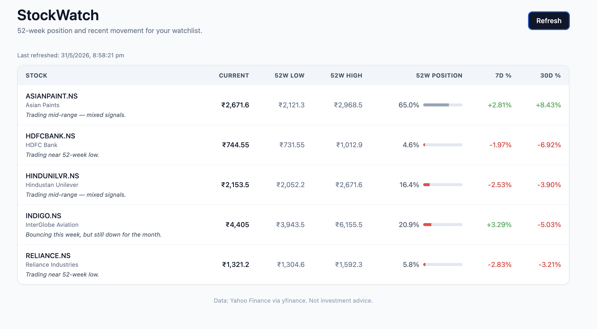

# StockWatch

A web app that tracks an Indian stock watchlist with 52-week position, recent
percent changes, and rule-based one-line "stories" describing each stock's situation.

**Live demo:** https://stockwatch-f7np.onrender.com



---

## What it does

For five Indian stocks (Reliance, IndiGo, Hindustan Unilever, Asian Paints, HDFC Bank),
StockWatch shows:

- **Current price** with 52-week range context
- **Position within the 52-week range** as a percentage and visual bar
- **7-day and 30-day percent changes** color-coded by direction
- **A one-sentence "story"** describing what the numbers mean in plain English
- **Auto-refreshed prices** via a daily GitHub Actions job

Designed for someone who wants to glance at a watchlist once a day and immediately
understand what's happening, without parsing six numbers per row.

---

## Architecture

Three independent services on free tiers:
### Layer breakdown

| Layer | Technology | Responsibility |
|---|---|---|
| Data source | yfinance (Python lib) | Fetches Yahoo Finance prices |
| Storage | PostgreSQL (Render free tier) | Persists 1y of daily closes per stock |
| Backend | FastAPI + SQLAlchemy + Pydantic | HTTP API + auto-generated docs |
| Frontend | Vanilla JS + Tailwind CDN | Dashboard rendering |
| Scheduler | GitHub Actions cron | Daily price updates |
| Hosting | Render (web + DB), GitHub (code + cron) | $0/month total |

### Project structure
---

## Running locally

```bash
git clone https://github.com/kumarnitish666/stockwatch.git
cd stockwatch
python -m venv .venv
source .venv/bin/activate
pip install -r requirements.txt
python backfill.py             # one-time: load 1 year of history
uvicorn api.main:app --reload --port 8000
```

Then open http://localhost:8000

The local version uses SQLite. Production uses Postgres. The same code handles
both — `db/session.py` reads `DATABASE_URL` from the environment and falls back
to SQLite if it isn't set.

---

## Design decisions

A few choices worth flagging because they shaped the rest of the project.

**SQLAlchemy ORM instead of raw SQL.** The same Python code works against SQLite
(local) and Postgres (production). Migrating between databases required changing
zero lines of business logic.

**Rule-based stories, not LLM-generated.** The "story" column ("trading near 52-week
low", "bouncing this week but still down for the month") is generated from 30 lines
of `if/elif` rules. An LLM version would cost ~$0.001 per stock per day and add
latency. The dumb version captures 80% of the value with 0% of the cost. Deferred
the AI version to a possible v2.

**GitHub Actions for scheduling, not Render Cron.** Render's free tier doesn't
include cron jobs. Rather than upgrading to a paid plan, the daily price refresh
runs on GitHub Actions (free) with the production `DATABASE_URL` stored as a
GitHub Secret. Two-host architecture is also more resilient than one.

**No frontend framework.** Vanilla JS + Tailwind via CDN. No build step, no
package.json, no transpiler. For a five-row dashboard, React would have added
complexity without value.

**Same FastAPI server for API + frontend.** Both `/api/*` and `/static/*` are
served from one process. No CORS configuration, no cross-domain auth issues.

---

## What's not built (deferred)

- **AI-generated stories** (LLM precomputed daily, cached)
- **Email/Slack alerts** when stocks hit configurable thresholds
- **User accounts** (currently a single shared watchlist)
- **Sector/index aggregation**
- **Charts of price history**
- **Custom domain**

The schema (`stocks` + `prices`) was designed so these additions are *new tables
alongside the existing ones* rather than modifications. Forward-compatible.

---

## License

MIT. Use freely. **Not investment advice.**